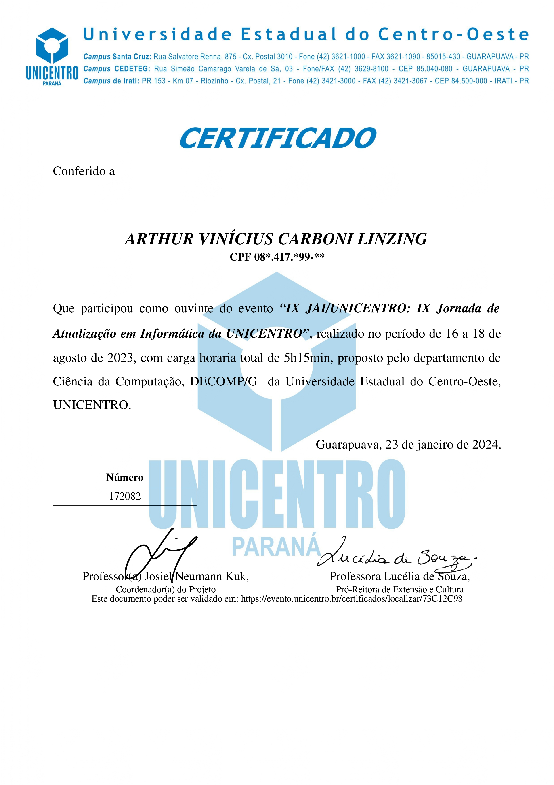
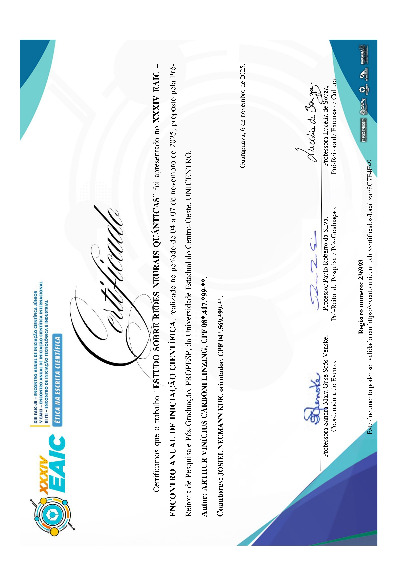
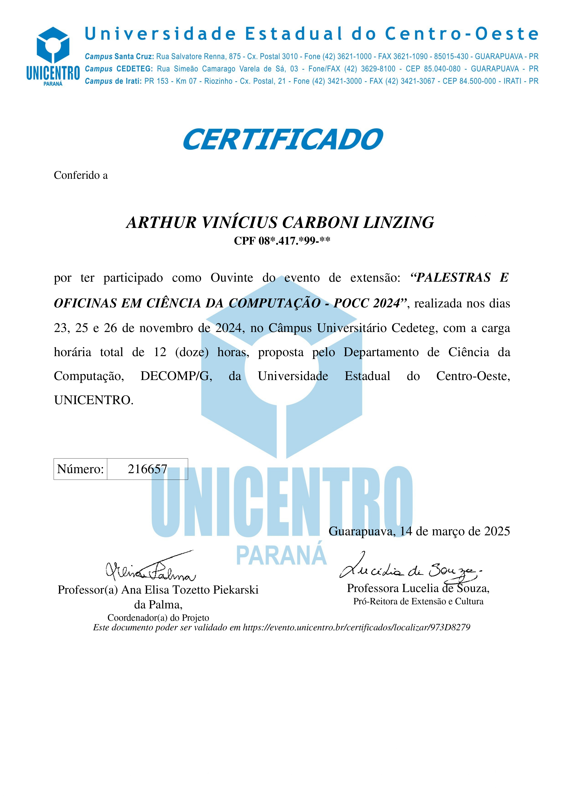

  

 

  
  
  

  
  
  
  

 

  

    Desenvolvedor Software com foco em backend, graduando em Ciência da Computação pela Unicentro em busca da primeira oportunidade na área.
    Tenho experiência acadêmica com Java/Spring Boot, Python, JavaScript, HTML/CSS, Dart/Flutter, C/C++, SQL e NoSQL.
    Além do código, possuo 3 anos de experiência como instrutor de programação pelo projeto E2PC,
    ensinando Python e Git/GitHub para alunos do ensino médio, e atuei como DevOps na Fábrica de Software da Unicentro.
  

<h2 align="center">Linguagens</h2>

  <table>
    <tr>
      <td align="center" width="96">
        
         Java
      </td>
      <td align="center" width="96">
        
         Python
      </td>
      <td align="center" width="96">
        
         JavaScript
      </td>
      <td align="center" width="96">
        
         C
      </td>
      <td align="center" width="96">
        
         C++
      </td>
      <td align="center" width="96">
        
         Dart
      </td>
      <td align="center" width="96">
        
         HTML
      </td>
      <td align="center" width="96">
        
         CSS
      </td>
    </tr>
  </table>

 

<h2 align="center">Tecnologias</h2>

  <table>
    <tr>
      <td align="center" width="96">
        
         Spring
      </td>
      <td align="center" width="96">
        
         Node.js
      </td>
      <td align="center" width="96">
        
         Flutter
      </td>
      <td align="center" width="96">
        
         Docker
      </td>
      <td align="center" width="96">
        
         Git
      </td>
      <td align="center" width="96">
        
         GitHub
      </td>
      <td align="center" width="96">
        
         PostgreSQL
      </td>
      <td align="center" width="96">
        
         MongoDB
      </td>
    </tr>
  </table>

 

<h2 align="center">Repositórios</h2>

 

  
  

       

  
  

      

<h4 align="center">
  <a href="https://github.com/CarboniArt?tab=repositories" title="Show Repositories">🔎 Mais repositórios aqui 🔍</a>
</h4>

 

<h2 align="center">Certificados</h2>

  
  
  

 

  

